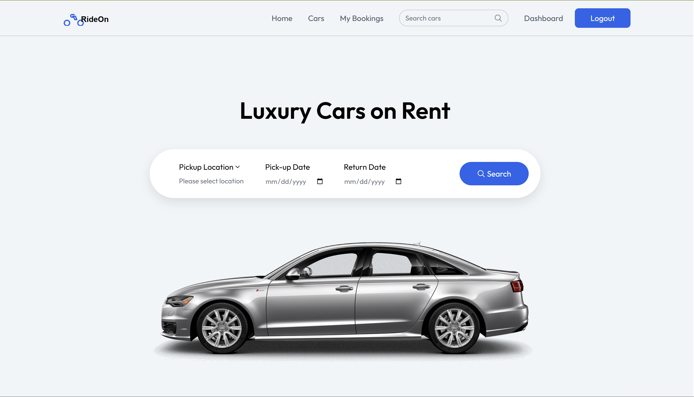
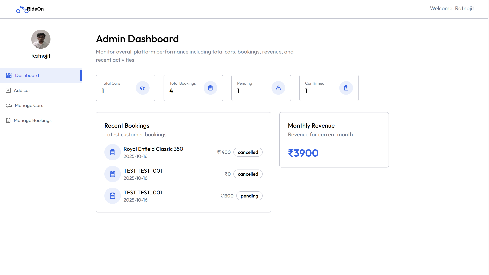

<div align="center">

  # RIDEON 🚖


*Powered by cutting-edge technologies:*


## LIVE - DEMO 🌐
Visit the 👉 [_LINK 🔗_]("https://ride-on-eight.vercel.app/owner")

</div>

---

## Table of Contents

- [Overview](#overview)
- [Key Features](#key-features)
- [Tech Stack](#tech-stack)
- [Project Structure](#project-structure)
- [Getting Started](#getting-started)
  - [Prerequisites](#prerequisites)
  - [Installation](#installation)
  - [Environment Variables](#environment-variables)
- [Usage](#usage)
- [API Endpoints](#api-endpoints)
- [Admin Features](#admin-features)
- [Deployment](#deployment)
- [Screenshots](#screenshots)
- [Contributing](#contributing)
---

## Overview

RIDEON is a full-featured vehicle rental platform that provides:

- 🚘 Extensive car, bike, and scooter inventory with filters
- 📅 Flexible booking system with date selection
- 🔐 Secure user authentication
- 📱 Responsive design for all devices
- 👨‍💼 Admin dashboard for fleet management
- 🖼️ Optimized media delivery with ImageKit

Designed to simplify the car, bike and scooter rental process for both customers and administrators.

---

## Key Features

### User Experience
- Browse available cars with filters
- View car details with high-quality images
- Select pickup location and dates
- Manage personal bookings
- User profile management

### Booking System
- Real-time availability checking
- Booking calendar
- Confirmation notifications
- Booking history
- Cancellation option

### Admin Dashboard
- Add/Edit/Remove vehicles
- Manage all bookings
- View rental statistics
- User management
- Inventory control

### Security & Performance
- JWT authentication
- Password encryption
- Protected admin routes
- Image optimization
- Fast loading times

---

## Tech Stack

### Frontend
- **React** with Vite
- **Context API** for state management
- **Axios** for HTTP requests
- **Tailwind CSS** for styling
- **React Icons** for beautiful icons
- **Date-fns** for date handling

### Backend
- **Node.js** with **Express**
- **MongoDB** with **Mongoose**
- **JWT** for authentication
- **Bcrypt** for password hashing
- **ImageKit** for media management
- **Multer** for file uploads

### DevOps
- **Vercel** for frontend hosting
- **Render** for backend hosting
- **GitHub Actions** for CI/CD

---

## Project Structure

```json
car-rental/
├── client/                  # Frontend application
│   ├── public/             # Static assets
│   ├── src/
│   │   ├── assets/         # Images, icons
│   │   ├── components/     # Reusable components
│   │   │   ├── owner/      # Admin components
│   │   │   │   ├── Login.jsx
│   │   │   │   ├── NavbarOwner.jsx
│   │   │   │   └── SideBar.jsx
│   │   │   ├── Banner.jsx
│   │   │   ├── CarCard.jsx
│   │   │   ├── FeaturedSection.jsx
│   │   │   └── ...         # Other components
│   │   ├── context/        # Global state
│   │   ├── pages/          # Route pages
│   │   │   ├── owner/      # Admin pages
│   │   │   │   ├── AddCar.jsx
│   │   │   │   ├── Dashboard.jsx
│   │   │   │   └── ...  
│   │   │   ├── CarDetails.jsx
│   │   │   ├── Cars.jsx
│   │   │   └── Home.jsx
│   │   └── ...             # Other config files
│
├── server/                 # Backend application
│   ├── configs/           # Configuration files
│   │   ├── db.js          # Database config
│   │   └── imageKit.js    # ImageKit config
│   ├── controllers/       # Business logic
│   │   ├── bookingController.js
│   │   ├── ownerController.js
│   │   └── userController.js
│   ├── middleware/        # Middlewares
│   │   ├── auth.js
│   │   └── multer.js
│   ├── models/            # Database models
│   │   ├── Booking.js
│   │   ├── Car.js
│   │   └── User.js
│   ├── routes/            # API routes
│   │   ├── bookingRoutes.js
│   │   ├── ownerRoutes.js
│   │   └── userRoutes.js
│   └── ...                # Other server files
```

---

## Getting Started

### Prerequisites

- Node.js (v18+)
- npm (v9+)
- MongoDB Atlas account or local MongoDB
- ImageKit account (for media storage)

### Installation

1. Clone the repository:
```console
git clone https://github.com/elyse502/car-rental.git
cd car-rental
```

2. Install dependencies for both client and server:
```console
# Install client dependencies
cd client && npm install

# Install server dependencies
cd ../server && npm install
```

3. Set up environment variables:
Create `.env` files in both `client` and `server` directories.

### Environment Variables

**Server (.env)**
```console
MONGO_URI=your_mongodb_connection_string
JWT_SECRET=your_jwt_secret_key
IMAGEKIT_PUBLIC_KEY=your_imagekit_public_key
IMAGEKIT_PRIVATE_KEY=your_imagekit_private_key
IMAGEKIT_URL_ENDPOINT=your_imagekit_endpoint
PORT=5000
```

**Client (.env)**
```console
VITE_API_BASE_URL=http://localhost:5000
```

4. Start the development servers:
```console
# In one terminal (server)
cd server && npm run dev

# In another terminal (client)
cd client && npm run dev
```

---

## Usage

### For Customers
1. **Browse Cars**: View available vehicles
2. **Select Dates**: Choose pickup/return dates
3. **Book Vehicle**: Complete booking process
4. **Manage Bookings**: View/cancel reservations

### For Admins
1. **Login**: Access admin dashboard
2. **Manage Fleet**: Add/edit/remove vehicles
3. **View Bookings**: Monitor all reservations
4. **Analytics**: View rental statistics

---

## API Endpoints

### Authentication
| Method | Endpoint          | Description          |
|--------|-------------------|----------------------|
| POST   | /api/auth/register| Register new user    |
| POST   | /api/auth/login   | Login user           |

### Cars
| Method | Endpoint          | Description          |
|--------|-------------------|----------------------|
| GET    | /api/cars         | Get all cars         |
| POST   | /api/cars         | Add new car (admin)  |
| GET    | /api/cars/:id     | Get car details      |

### Bookings
| Method | Endpoint           | Description          |
|--------|--------------------|----------------------|
| POST   | /api/bookings      | Create new booking   |
| GET    | /api/bookings/user | Get user bookings    |
| DELETE | /api/bookings/:id  | Cancel booking       |

---

## Admin Features

- **Vehicle Management**
  - Add new cars with specifications
  - Edit existing vehicle details
  - Remove vehicles from inventory

- **Booking Oversight**
  - View all bookings
  - Filter bookings by date/status
  - Manage booking approvals

- **User Management**
  - View registered users
  - Monitor user activity
  - Handle support requests

---

## Deployment

### Frontend
[](https://vercel.com/new/clone?repository-url=https%3A%2F%2Fgithub.com%2Fyourusername%2Fcar-rental%2Ftree%2Fmain%2Fclient)

### Backend
Deploy to Render, Vercel, or other Node.js hosting services with MongoDB connection.

---

## Screenshots

<div align="center">

  ### HOME PAGE

</div>

 

<div align="center">

  ### ADMIN DASHBOARD

</div>




---

## Contributing

1. Fork the repository
2. Create your feature branch (`git checkout -b feature/AmazingFeature`)
3. Commit your changes (`git commit -m 'Add some AmazingFeature'`)
4. Push to the branch (`git push origin feature/AmazingFeature`)
5. Open a Pull Request

---

## License

Distributed under the MIT License. See `LICENSE` for more information.

---

## 📞 Contact  

For any questions or support, feel free to reach out:  

- [**Ratnojit Saha**](https://www.linkedin.com/in/saharatnojit/) 👨‍💻  
- 🌐 [GitHub](https://github.com/ratnojitsaha)  
- 💼 [LinkedIn](https://www.linkedin.com/in/saharatnojit/)  
- ✉️ **Email:** [saharatnojit04@gmail.com](mailto:saharatnojit04@gmail.com)  
- 🚀 [Project Link](https://github.com/ratnojitsaha)  

---

[](https://www.linkedin.com/in/saharatnojit/)  
[](https://github.com/ratnojitsaha)  
[](https://github.com/ratnojitsaha)

---

<div align="center">

**RIDE-ON** - Your journey starts here! 🛣️✨

**Made with ❤️ by <i>[RATNOJIT SAHA](https://github.com/ratnojitsaha)</i>**

[⬆ Back to Top](#table-of-contents)

</div>


